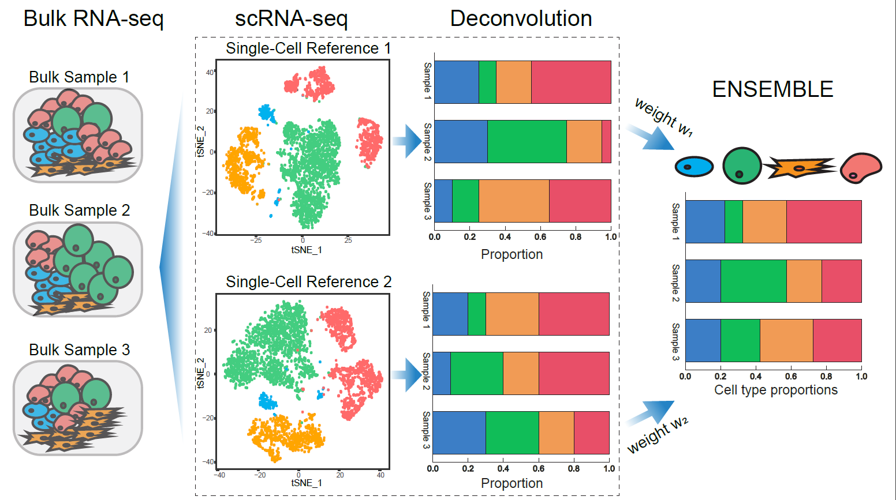

<!-- README.md is generated from README.Rmd. Please edit that file -->

```{r, include = FALSE}
knitr::opts_chunk$set(
  collapse = TRUE,
  comment = "#>",
  fig.path = "man/figures/README-",
  out.width = "100%"
)
```
# SCDC: Bulk Gene Expression Deconvolution by Multiple Single-Cell RNA Sequencing References

<!-- badges: start -->
[](https://travis-ci.org/meichendong/SCDC)
[](https://CRAN.R-project.org/package=SCDC)
<!-- badges: end -->

SCDC is a [deconvolution](https://en.wikipedia.org/wiki/Deconvolution) method for bulk [RNA-seq](https://en.wikipedia.org/wiki/RNA-Seq) that leverages cell-type specific gene expressions from **multiple [scRNA-seq](https://en.wikipedia.org/wiki/Single_cell_sequencing) reference datasets**.
SCDC adopts an ENSEMBLE method to integrate deconvolution results from different scRNA-seq datasets that are produced in different laboratories and at different times, implicitly addressing the [batch-effect](http://www.molmine.com/magma/global_analysis/batch_effect.html) confounding.



## Installation

You can install the released version of SCDC from [GitHub](https://github.com/) with:

``` r
if (!require("devtools")) {
  install.packages("devtools")
}
devtools::install_github("meichendong/SCDC")
```
## Vignettes

Please see the [vignettes page](https://meichendong.github.io/SCDC/articles/SCDC.html).

The SCDC paper is published at [Briefings In Bioinformatics](https://doi.org/10.1093/bib/bbz166).


