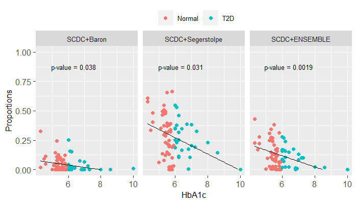
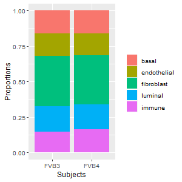

```{r, include = FALSE}
knitr::opts_chunk$set(
  collapse = TRUE,
  comment = "#>"
)
```

**SCDC** adopts an ENSEMBLE method to integrate deconvolution results
across methods and datasets, giving reference data that are more close to the
bulk RNA-seq data higher weights, implicitly addressing the batch-effect confounding
when multiple scRNA-seq reference sets are available.

Our manuscript is available at [bioRxiv](https://www.biorxiv.org/content/10.1101/743591v1?rss=1).

## Installation

```r
if (!require("devtools")) {
  install.packages("devtools")
}
devtools::install_github("meichendong/SCDC")
```

## Data Input

SCDC takes `ExpressionSet` objects with raw read counts as input. `ExpressionSet` object is based on the package [_Biobase_](https://bioconductor.org/packages/release/bioc/html/Biobase.html), which mainly stores data matrix (genes by samples), featureData (information about genes), and phenoData (information about samples, like the clustering results, subjects, conditions).
We also enable a quick construction of the ExpressionSet object by the function `getESET()`. Here we show a toy example:

```{r, message=F}
library(SCDC)
counts <- matrix(sample(0:500, 25), nrow = 5)
colnames(counts) <- paste("cell",1:5, sep = "")
rownames(counts) <- paste("gene",1:5, sep = "")
counts
fdata <- rownames(counts)
pdata <- cbind(cellname = colnames(counts), subjects = paste("patient", rep(1,5)))
eset <- getESET(counts, fdata = fdata, pdata = pdata)
class(eset)
```

As an illustration of the **SCDC** framework, we analyze the pancreatic islet data as presented in our paper. Three public scRNA-seq datasets from [Baron et al. (2016)](https://www.sciencedirect.com/science/article/pii/S2405471216302666?via%3Dihub), [Segerstolpe et al. (2016)](https://www.sciencedirect.com/science/article/pii/S1550413116304363?via%3Dihub) and [Xin et al. (2016)](https://www.sciencedirect.com/science/article/pii/S155041311630434X?via%3Dihub) are used; a bulk RNA-seq dataset from [Fadista et al. (2014)](https://www.pnas.org/content/111/38/13924) is used in the real data analysis. 
We also applied our method to a three-cell-line mixture data from [Perou lab](https://unclineberger.org/peroulab/), where the cell lines MDA-MB-468, MCF-7, and normal fibroblast cells are cultured by the ratio 6:3:1. Both scRNA-seq and bulk RNA-seq data are available.

The processed data is available for download at the [SCDC data page](https://meichendong.github.io/SCDC/articles/web/SCDC_data.html).

## SCDC Pre-process of scRNA-seq Data
For each single-cell dataset with raw counts, we can first explore the demographic information by the visualization function `DemoPlot`. Here, single cells from each subject are summarized by total counts, counts per cell type, and the overall composition. This gives us a general understanding of a dataset. Take scRNA-seq data of healthy subjects from Segerstolpe et al. as an example, and we derive the following plot:

```r
ct1 <- c("mediumorchid1","mediumpurple1","lightskyblue","seagreen1","yellow","tan1","azure3")
seger <- readRDS("segerstolpe.rds")
DemoPlot(seger, cluster = "cluster", sample = "sample", select.ct = c("alpha","beta","delta","gamma","ductal","acinar"), Palette = ct1)
```

<center>
{width=400px}
</center>

To make SCDC robust to single-cell clustering, a quality control procedure is performed as a first step to remove cells with questionable cell-type assignments, as well as cells with low library preparation and sequencing quality. Specifically, each single cell is treated as a “bulk” sample and its cell-type composition can be derived by a first-pass run of SCDC. 
The threshold of keeping a single cell from an assigned cluster is chosen as 0.7 in this illustration example. This user-defined threshold should be selected carefully, to achieve the effect of quality control of single cells without obstructing the performance on the downstream analysis. An unproper threshold could potentially lead to filtering out a large proportion of cells from rare cell types. To be conservative, this can be chosen from (0.5,0.7).

```r
seger.qc <- SCDC_qc(seger, ct.varname = "cluster", sample = "sample", scsetname = "Segerstolpe",
                  ct.sub = c("alpha","beta","delta","gamma","ductal","acinar"), qcthreshold = 0.7) 
seger.qc$heatfig
```
<center>
{width=350px}
</center>

Similarly, we can perform clustering QC for single cells from only one subject using function `SCDC_qc_ONE()`.


## SCDC on Simulated Data
SCDC allows users to construct pseudo bulk samples in two ways:

- `generateBulk_allcells()`: Sum up gene-wise raw read counts per subject, and the true cell-type proportion is consistent with the single cell clustering result.

- `generateBulk_norep()`: Randomly sample single cells from each of the cell types of interest without replacement, and then sum up raw read counts per subject. The cell-type proportions are different from single cell clustering result.

Here, we use the `ExpressionSet` objects after the clustering-QC of each scRNA-seq dataset. Read in the processed objects downloaded from our webpage:

```r
# ExpressionSet objects from the three different scRNA-seq resources
# setwd("your/working/directory")
qc.seger <- readRDS("qc_segerstolpe.rds")
qc.baron <- readRDS("qc_baron.rds")
qc.xin <- readRDS("qc_xin.rds")
```

Then create the _pseudo bulk_ samples as follows. `ct.varname` specifies the variable name of your single cell clustering result variable. `sample` specifies the variable indicating subjects or individuals information. `ct.sub` specifies the subset of cell types you want to use to construct pseudo bulk samples.
```r
## (1) using all single cells
pseudo.seger <- generateBulk_allcells(qc.seger$sc.eset.qc, ct.varname = "cluster", sample = "sample", ct.sub = c("alpha","beta","delta","gamma"))

## (2) using random proportions of single cells
pseudo.seger.rand <- generateBulk_norep(qc.seger$sc.eset.qc, ct.varname = "cluster", sample = "sample", ct.sub = c("alpha","beta","delta","gamma"), nbulk = 3)

## we know the true relative proportions for the pseudo bulk samples:
round(pseudo.seger$truep,3)
round(pseudo.seger.rand$true_p,3)
```

The constructed _pseudo bulk_ object includes the true cell-type proportion matrix `pseudo.seger$truep` and the `ExpressionSet` object `pseudo.seger$pseudo_eset`.

To perform deconvolution using one reference scRNA-seq dataset, use the `SCDC_prop()` function:
```r
bulkseger.scseger <- SCDC_prop(bulk.eset = pseudo.seger$pseudo_eset, sc.eset = qc.seger$sc.eset.qc, ct.varname = "cluster", sample = "sample", ct.sub = c("alpha","beta","delta","gamma"), truep = pseudo.seger$truep)
bulkseger.scbaron <- SCDC_prop(bulk.eset = pseudo.seger$pseudo_eset, sc.eset = qc.baron$sc.eset.qc, ct.varname = "cluster", sample = "sample", ct.sub = c("alpha","beta","delta","gamma"), truep = pseudo.seger$truep)
bulkseger.scxin <- SCDC_prop(bulk.eset = pseudo.seger$pseudo_eset, sc.eset = qc.xin$sc.eset.qc, ct.varname = "cluster", sample = "sample", ct.sub = c("alpha","beta","delta","gamma"), truep = pseudo.seger$truep)

bulkseger.scseger$peval$evals.table
#>         RMSD     mAD      R
#> SCDC 0.03352 0.02553 0.9912
bulkseger.scbaron$peval$evals.table
#>         RMSD     mAD     R
#> SCDC 0.08337 0.06499 0.954
bulkseger.scxin$peval$evals.table
#>         RMSD     mAD      R
#> SCDC 0.19058 0.15449 0.9331
```
We can observe the discrepancy of performance using different datasets. In this example, when using single cells from the reference dataset Segerstolpe et al., we derive the highest Pearson correlation, and the lowest RMSD and mAD.

Next, we will explore the ENSEMBLE method integrating all the three scRNA-seq reference datasets using the pseudo bulk samples constructed above.
Here we offered three methods to derive the ENSEMBLE weights: 'Grid search', 'LAD', and 'NNLS'. The default setting is using all these three methods. The search length is a parameter representing the search step size, which is related to the grid search method. 
```r
#input the list of single cell ExpressionSet objects
pancreas.sc <- list(baron = qc.baron$sc.eset.qc,
                    seger = qc.seger$sc.eset.qc,
                    xin = qc.xin$sc.eset.qc)
# This might take several minutes, depending on the search.length set by user.
PS_ensemble <- SCDC_ENSEMBLE(bulk.eset = pseudo.seger$pseudo_eset, sc.eset.list = pancreas.sc, ct.varname = "cluster",
                             sample = "sample", truep = pseudo.seger$truep[complete.cases(pseudo.seger$truep),], ct.sub =  c("alpha","beta","delta","gamma"), search.length = 0.01)
PS_ensemble$w_table
#>                              w1        w2   w3    RMSD     mAD Pearson
#> max.Pearson_prop    0.0200000000 0.9300000 0.05 0.03627 0.02779  0.9913
#> min.mAD_Y           0.0000000000 1.0000000 0.00 0.03376 0.02509  0.9907
#> min.RMSD_Y          0.0000000000 1.0000000 0.00 0.03376 0.02509  0.9907
#> max.Spearman_corr_Y 0.0000000000 0.9600000 0.04 0.03538 0.02712  0.9912
#> min.mAD_Y_LAD       0.0002156889 0.9997843 0.00 0.03376 0.02509  0.9907
#> min.RMSD_Y_NNLS     0.0000000000 1.0000000 0.00 0.03376 0.02509  0.9907
#>                     spearman_Y    RMSD_Y     mAD_Y
#> max.Pearson_prop       0.91429 0.0003501 2.785e-05
#> min.mAD_Y              0.91420 0.0003437 2.755e-05
#> min.RMSD_Y             0.91420 0.0003437 2.755e-05
#> max.Spearman_corr_Y    0.91449 0.0003467 2.777e-05
#> min.mAD_Y_LAD          0.91420 0.0003438 2.755e-05
#> min.RMSD_Y_NNLS        0.91420 0.0003437 2.755e-05
```
In this case, SCDC ENSEMBLE weights suggest that the weight for results from reference dataset Segerstolpe et al. to be one. Hence, the final estimated cell-type proportions can be found at `PS_ensemble$prop.list$seger$prop.est.mvw`.

## SCDC on Real Bulk RNA-seq Data
Here, we move on to analyze the real pancreatic islet bulk RNA-seq dataset. Fadista et al. (2014) provided 89 bulk samples, of which 77 samples have the HbA1c level information(an important biomarker for the Type II diabetes). Hence, we focus on the deconvolution for the 77 bulk samples (51 healthy and 26 diabetic).
To allow the basis matrix to reflect the potentially different gene expression patterns between the cases and controls, we performed the ENSEMBLE weight selection procedures for the samples from the two classes (normal and T2D) separately.

```r
fadista_77 <- readRDS("fadista_77.rds")
# setting the search.length as 0.01 might take several minutes to finish the ENSEMBLE procedure.
fadista.healthy.ens <- SCDC_ENSEMBLE(bulk.eset = fadista_77[,fadista_77$hba1c_class2 == "Normal"],
                                     sc.eset.list = list(baron = qc.baron$sc.eset.qc, seger = qc.seger$sc.eset.qc),
                                     ct.varname = "cluster", sample = "sample", truep = NULL,
                                     ct.sub =  c("alpha","beta","delta","gamma","acinar","ductal"), search.length = 0.01)
fadista.t2d.ens <- SCDC_ENSEMBLE(bulk.eset = fadista_77[,fadista_77$hba1c_class2 == "T2D"],
                                 sc.eset.list = list(baron = qc.baron$sc.eset.qc, seger = qc.seger$sc.eset.qc),
                                 ct.varname = "cluster", sample = "sample", truep = NULL,
                                 ct.sub =  c("alpha","beta","delta","gamma","acinar","ductal"), search.length = 0.01)
> fadista.healthy.ens$w_table
#>                           w1        w2 spearman_Y    RMSD_Y     mAD_Y
#> min.mAD_Y           0.4400000 0.5600000    0.77554 0.0003397 4.710e-05
#> max.Spearman_corr_Y 0.4200000 0.5800000    0.77559 0.0003434 4.711e-05
#> min.mAD_Y_LAD       0.4462969 0.5537031    0.77551 0.0003386 4.711e-05
> fadista.t2d.ens$w_table
#>                            w1        w2 spearman_Y    RMSD_Y     mAD_Y
#> min.mAD_Y           0.4900000 0.5100000    0.79769 0.0002810 4.475e-05
#> max.Spearman_corr_Y 0.5000000 0.5000000    0.79770 0.0002795 4.476e-05
#> min.mAD_Y_LAD       0.5163056 0.4836944    0.79768 0.0002773 4.478e-05
```
To compare the ENSEMBLE results to the deconvolution results using one reference dataset only, we visualize the estimated proportions as following:
```r
library(reshape2)
library(ggplot2)
getPropBox <- function(ens_h, ens_d, w1h, w2h, w1d,w2d, ref){
  prop.h <- ens_h$prop.list[[1]]$prop.est.mvw*w1h + ens_h$prop.list[[2]]$prop.est.mvw*w2h
  prop.h <- as.data.frame(prop.h)

  prop.d <- ens_d$prop.list[[1]]$prop.est.mvw*w1d + ens_d$prop.list[[2]]$prop.est.mvw*w2d
  prop.d <- as.data.frame(prop.d)

  prop2 <- rbind(prop.h, prop.d)
  prop2$condition <- c(rep("Normal", nrow(prop.h)), rep("T2D", nrow(prop.d)))

  dtmelt <- melt(prop2, id.vars = "condition")
  dtmelt$ref <- as.factor(ref)
  return(dtmelt)
}

# Note in the following fdt.ens, the weights 0.45, 0.55, 0.52 and 0.48 are selected through 
# the previous step from the fadista.healthy.ens$w_table and fadista.t2d.ens$w_table, the 'min.mAD_Y_LAD' method.
fdt.ens <- getPropBox(ens_h = fadista.healthy.ens, ens_d = fadista.t2d.ens, w1h = 0.45, w2h = 0.55, w1d = 0.52, w2d = 0.48, ref = "ENSEMBLE")
fdt.seger <- getPropBox(ens_h = fadista.healthy.ens, ens_d = fadista.t2d.ens, w1h = 0, w2h =1, w1d = 0, w2d = 1, ref = "Segerstolpe")
fdt.baron <- getPropBox(ens_h = fadista.healthy.ens, ens_d = fadista.t2d.ens, w1h = 1, w2h =0, w1d = 1, w2d = 0, ref = "Baron")
dtall_fadista <- rbind(fdt.ens, fdt.seger, fdt.baron)
dtall_fadista$refcond <- paste(dtall_fadista$ref, dtall_fadista$condition)
colfunc <- colorRampPalette(c("red", "white"))
colfunc2 <- colorRampPalette(c("blue", "white"))
fadista.ens.plot <- ggplot(dtall_fadista, aes(x=variable, y=value, color = factor(refcond,
                                                                      levels = c("ENSEMBLE Normal", "Segerstolpe Normal","Baron Normal",
                                                                                 "ENSEMBLE T2D","Segerstolpe T2D","Baron T2D")))) +
  geom_boxplot(outlier.size=-1)+
  geom_jitter(aes(x=variable,
                  color = factor(refcond,
                                 levels = c("ENSEMBLE Normal", "Segerstolpe Normal","Baron Normal",
                                            "ENSEMBLE T2D" ,"Segerstolpe T2D","Baron T2D"))),
              position = position_dodge(0.75), alpha = 0.5,cex = 0.25)+
  theme(axis.text.x = element_text(angle = 30, hjust = 1, size=10),
        axis.text.y = element_text(size = 10),
        text = element_text(size = 10),
        plot.title = element_text(size=10, face = "bold"),
        plot.margin=unit(c(1,1,-5,0), "mm"),
        legend.position="top",legend.title = element_blank(),
        legend.text = element_text(size=8),
        legend.box.spacing = unit(0, "mm"))+
  scale_color_manual(values=c(colfunc(10)[c(3,5,7)],colfunc2(10)[c(3,5,7)])) +
  ylab("") + xlab("")
print(fadista.ens.plot)
```
<center>
{width=600px}
</center>

In our paper, we sought to replicate previous findings on the negative correlation
between the [hemoglobin A1c](https://www.webmd.com/diabetes/guide/glycated-hemoglobin-test-hba1c) (HbA1c, an important biomarker for type 2 diabetes)
levels and the beta cell functions ( [Kanat et al., 2011](https://care.diabetesjournals.org/content/34/4/1006.long), [Hou et al., 2016](https://www.ncbi.nlm.nih.gov/pmc/articles/PMC4657079/)). 
Hence, we constructed a linear model using the estimated cell-type proportions as the response variable and the other covariates (age, gender, BMI, and HbA1c) as predictors. Here we compare deconvolution results from three sources: 1) scRNA-seq from Segerstolpe et al. only; 2) scRNA-seq from Baron et al. only; 3) ENSEMBLE deconvolution results using scRNA-seq from Segerstolpe et al. and Baron et al. separately.

```r
## we use the scRNA-seq datasets without clustering-QC as input here, aiming to be comparable to the results as MuSiC shown in their paper.
baron <- readRDS("baron.rds")
seger <- readRDS("segerstolpe.rds")
## SCDC deconvolution using one ref dataset:
fadista.seger <- SCDC_prop(fadista_77, seger, ct.varname = "cluster", sample = "sample",
                          ct.sub = c("alpha","beta","delta","gamma","acinar","ductal"))

fadista.baron <- SCDC_prop(fadista_77, baron, ct.varname = "cluster", sample = "sample",
                                ct.sub = c("alpha","beta","delta","gamma","acinar","ductal"))
## ENSEMBLE proportions
getPropbycond <- function(ens_h, ens_d, w1h, w2h, w1d,w2d, ref, hba1clvl){
  prop.h <- ens_h$prop.list[[1]]$prop.est.mvw*w1h + ens_h$prop.list[[2]]$prop.est.mvw*w2h
  prop.h <- as.data.frame(prop.h)

  prop.d <- ens_d$prop.list[[1]]$prop.est.mvw*w1d + ens_d$prop.list[[2]]$prop.est.mvw*w2d
  prop.d <- as.data.frame(prop.d)

  prop2 <- rbind(prop.h, prop.d)
  prop2$condition <- c(rep("Normal", nrow(prop.h)), rep("T2D", nrow(prop.d)))
  return(prop2)
}
fadista_ens_prop <- getPropbycond(ens_h = fadista.healthy.ens, ens_d = fadista.t2d.ens,
                                  w1h = 0.45, w2h = 0.55, w1d = 0.52, w2d = 0.48, ref = "ENSEMBLE")
```

Fit linear models: beta cell proportion ~ HbA1c + age + BMI + sex.
```r
## get demographic information of the bulk samples from Fadista et al.
fadista_demo <- fadista_77@phenoData@data[,c("age","gender","hba1c","bmi","hba1c_class2")]
## the following getLMpValue() function is to perform the linear regression and wrap the linear model results
getLMpValue <- function(prop_est, method_){
  prop_est_all <- cbind(prop_est, fadista_demo[rownames(prop_est),])
  getlmtable <- function(ct){
    prop_est_all$ct <- prop_est_all[,ct]
    lm.ens1 <- lm(ct ~ hba1c + age + bmi + gender, data = prop_est_all)
    s1 <- summary(lm.ens1)
    sdt <- cbind(round(s1$coefficients,4), celltype = rep(ct,5))
    return(sdt)
  }
  dtlm <- NULL
  for (ct in intersect(c("alpha","beta","delta","gamma","acinar","ductal"),
                       colnames(prop_est))){
    dtlm0 <- getlmtable(ct)
    dtlm <- rbind(dtlm, dtlm0)
  }
  dat_text_fad <- data.frame(label = paste("p-value =",dtlm[seq(from = 2 , to = 27, by=5),c(4)]),
                             variable = dtlm[seq(from = 2 , to = 27, by=5),c(5)],
                             hba1c = 6, value = 0.5,
                             condition = "T2D",
                             method = method_)
  demo_pval <- data.frame(label = paste("p-value =",dtlm[,c(4)]),
                          variable = dtlm[,c(5)],
                          value = 0.5,
                          covar =rownames(dtlm),
                          condition = "T2D",
                          method = method_)
  dtmelt <- melt(prop_est_all, id.vars = c("hba1c_class2","age","gender","bmi","hba1c"), measure.vars = c("alpha","beta","delta","gamma","acinar","ductal"))
  dtmelt$method <- method_
  return(list(meltdata = dtmelt, pvaldata = dat_text_fad, demo_pval = demo_pval))
}
res.SCDC.seger <- getLMpValue(prop_est = fadista.seger$prop.est.mvw, method_ = "SCDC+Segerstolpe")
res.SCDC.baron <- getLMpValue(prop_est = fadista.baron$prop.est.mvw, method_ = "SCDC+Baron")
res.SCDC.ensemble <- getLMpValue(prop_est = fadista_ens_prop, method_ = "SCDC+ENSEMBLE")
## pool the results together for visualization:
alldata <- rbind(res.SCDC.seger$meltdata, res.SCDC.ensemble$meltdata,
                 res.SCDC.baron$meltdata)
allpvalue <- rbind(res.SCDC.seger$pvaldata, res.SCDC.ensemble$pvaldata,
                   res.SCDC.baron$pvaldata)
demopval <- rbind(res.SCDC.seger$demo_pval, res.SCDC.ensemble$demo_pval,
                  res.SCDC.baron$demo_pval)
alldata$method <- as.factor(alldata$method)
```

Comparing ENSEMBLE proportion estimation results with the one-reference deconvolution results. Here we visualize the beta-cell proportions with the HbA1c levels, and present the p-values for HbA1c coefficient from each model. 

```r
fadista.LMplot <- ggplot(alldata[alldata$variable %in% c("beta"),], aes(x=hba1c, y= value)) + geom_point(aes(color = hba1c_class2)) +
  geom_smooth(method='lm', se = FALSE, color = "black", lwd = 0.25) +
  theme(legend.position = "top", legend.title = element_blank(), # axis.title.x = element_blank(),
        legend.box.spacing = unit(0, "mm"),
        text = element_text(size=9),
        axis.text.x = element_text(size=9),
        axis.text.y = element_text(size=9))+#, axis.title.y = element_blank()) +
  facet_grid(cols = vars(factor(method, levels = c("SCDC+Baron", "SCDC+Segerstolpe", "SCDC+ENSEMBLE"))),scales = "free") +
  geom_text(data = allpvalue[allpvalue$variable %in% c("beta"),],
            mapping = aes(x=5.5, y=0.85,label = label),
            hjust   = 0.2, vjust   = 0, size = 2.5) +
  xlab("HbA1c") + ylab("Proportions") + ylim(c(0,1))
fadista.LMplot
```
<center>

</center>

We see that SCDC ENSEMBLE method derives the p-value of 0.0019 <0.05, indicating a statistically significant association between the beta-cell proportions and the HbA1c levels.

## Three Cell-line Mixture Data Analysis
In the real world, some identified cell types are hard to be distinguished in certain environment. Employing a hierachical deconvolution structure (tree-guided deconvolution structure) may work better than a straightforward deconvolution. Here, using the three-cell-line mixture sample, we show how deconvolution is performed by SCDC when only one subject is available. Also, by looking at the hierarchical structure of cell lines, we see two of the cell lines are mroe closely related. Hence, we can show how a tree-guided deconvolution step is applied in this simple case.

```r
qc.3cl <- readRDS("MIX3cl_scESET.rds")
sc3cl.basis <- SCDC_basis_ONE(qc.3cl$sc.eset.qc, ct.varname = "md_cluster", sample ="orig.ident")
df.d <- dist(t(log(sc3cl.basis$basis.mvw + 1e-10)), method = "euclidean")
hc1 <- hclust(df.d, method = "complete")
plot(hc1, cex = 0.8, hang = -1, main = "log(basis matrix)")
```
<center>
 
</center>

The tree-structured deconvolution procedure will allow users to specify a 'meta cluster' by their own professional judgment. Without the requirement for marker genes input, we could employ the function `SCDC_prop_ONE_subcl_marker()` to deconvolve the bulk samples.

```r
bulk3cl <- readRDS("MIX3cl_bulkESET.rds")
sc3cl2 <- qc.3cl$sc.eset.qc
sc3cl2$md_cluster2 <- sc3cl2$md_cluster
sc3cl2$md_cluster2[!sc3cl2$md_cluster2 %in% "NormalFibroblast"] <- "Tumor"
# deconv_3cl <- SCDC_prop_ONE(bulk.eset = bulk3cl, sc.eset = sc3cl2, ct.varname = "md_cluster", sample = "orig.ident", ct.sub = unique(sc3cl$md_cluster), weight.basis = T)
SCDC_3cl_tree <- SCDC_prop_ONE_subcl_marker(bulk.eset = bulk3cl, sc.eset = sc3cl2, ct.varname = "md_cluster",
                                             sample = "orig.ident", ct.sub = unique(sc3cl2$md_cluster),
                                             ct.fl.sub = unique(sc3cl2$md_cluster2) , weight.basis = T,
                                             fl.varname = "md_cluster2", select.marker = T, LFC.lim = 5)
#> WNNLS for Second level clusters MCF7 MDA-MB468 Converged at iteration  3
SCDC_3cl_tree$prop.est
#>        MCF7 MDA-MB468 NormalFibroblast
#> 1 0.2561348 0.6367564        0.1071088
```
The choice of limit for LogFoldChange `LFC.lim=5` could be changed by users. 
Empirically, a good threshold value would cut the number of genes to 1000~2000, which we believe is an adequate number to detect the inter-cell-type variations.


## Mouse Mammary Gland Data Analysis
Using the single cell clustering package [Seurat](https://satijalab.org/seurat/), we classified the mouse mammary gland single cells into five cell types of interest: endothelial, fibroblast, luminal, basal and immune cells. In our paper, we perform deconvolution for mouse mammary gland tissue bulk RNA-seq data of two forms: fresh-frozen and 10X. The detailed data process structure is shown in the figure 5 of our paper.

As an illustration for our functions, we only show how deconvolution of the 10X bulk samples is performed as follows. The processed fresh-frozen bulk RNA-seq data is also available at our data download page.

First we show the deconvolution using function `SCDC_prop_subcl_marker()` utilizing each of the single cell reference dataset separately.

```r
## read in ExpressionSet object from Perou lab, and Tabula Muris
bulk10x <- readRDS("peroubulk10x_fvb34.rds")
qc.perou<- readRDS("qc_perou.rds")
qc.tmouse<- readRDS("qc_tmouse.rds")

## you could try the SCDC_prop() function for deconvolution without tree-guided structure first, 
## but based on biological knowledge and the single cell information we have now, the proportions estimation result
## might not reflect the proportions that are close to truth.

## here, tree-guided two-level deconvolution is performed (takes around 2 min):
perou <- qc.perou$sc.eset.qc
tmouse <- qc.tmouse$sc.eset.qc

perou$metacluster2[perou$md_cluster %in% c( "immune")] <- "immune"
perou$metacluster2[perou$md_cluster %in% c("basal","luminal","fibroblast","endothelial")] <- "BaLuFibEndo"
subcl.10x.perou <- SCDC_prop_subcl_marker(bulk.eset = bulk10x, sc.eset = perou, ct.varname = "md_cluster", fl.varname = "metacluster2",
                                       sample = "subj", ct.sub = c("endothelial","fibroblast","immune","luminal","basal"),
                                       ct.fl.sub = unique(perou$metacluster2), select.marker = T, LFC.lim = 5)

tmouse$metacluster2[tmouse$md_cluster %in% c("immune")] <- "immune"
tmouse$metacluster2[tmouse$md_cluster %in% c("endothelial", "fibroblast","luminal","basal")] <- "BaLuFibEndo"
subcl.10x.tmouse <- SCDC_prop_subcl_marker(bulk.eset = bulk10x, sc.eset = tmouse, ct.varname = "md_cluster", fl.varname = "metacluster2",
                                        sample = "subj", ct.sub = c("endothelial","fibroblast","immune","luminal","basal"),
                                        ct.fl.sub = unique(tmouse$metacluster2), select.marker = T, LFC.lim = 5)
```   

Then we proceed with the ENSEMBLE step. Note that you can also input the deconvolution results from other methods like MuSiC, CIBERSORTx, Bisque, etc. If the predicted gene expression levels are not available from your one-reference deconvolution results, the input elements we require here consist of at least two parts: the basis/signature/feature/profile matrix (genes by cell types), and the estimated cell-type proportions matrix (cell types by samples).

```r                                    
## The above subcl.10x.tmouse and subcl.10x.perou objects do not include a predicted gene expression levels element (yhat), here we calculate yhat first:
yhat.10x.perou <- subcl.10x.perou$sc.basis$basis.mvw %*% t(subcl.10x.perou$prop.est)[colnames(subcl.10x.perou$sc.basis$basis.mvw)]
yhat.10x.tmouse <- subcl.10x.tmouse$sc.basis$basis.mvw %*% t(subcl.10x.tmouse$prop.est)[colnames(subcl.10x.tmouse$sc.basis$basis.mvw)]
subcl.10x.perou$yhat <- yhat.10x.perou
subcl.10x.tmouse$yhat <- yhat.10x.tmouse

## integrate the deconvolution results from the tree-guided functions:
ens_subcl_perou10x <- SCDC_ENSEMBLE_subcl(bulk.eset = bulk10x, prop.list = list(tmouse.subcl = subcl.10x.tmouse, perou.subcl = subcl.10x.perou),
                                          ct.sub = c("endothelial","fibroblast","immune","luminal","basal"), search.length = 0.01)
## now calculate the ENSEMBLE cell-type proportions
## the default weights are selected from the LAD regression method. You can also specify other methods, see the function details.
ens.10x.prop <- ENSEMBLE_prop(ENSobject = ens_subcl_perou10x)
ens.10x.prop
#>         basal endothelial fibroblast   luminal    immune
#> FVB3 0.1631129   0.1579636  0.3522990 0.1788436 0.1477809
#> FVB4 0.1611617   0.1544663  0.3448059 0.1760214 0.1635448
```

Visualization of the proportion estimation results:

<center>

</center>

<!-- 
pending... -->


<font color='blue'>
_Thanks for using SCDC!_
</font>

